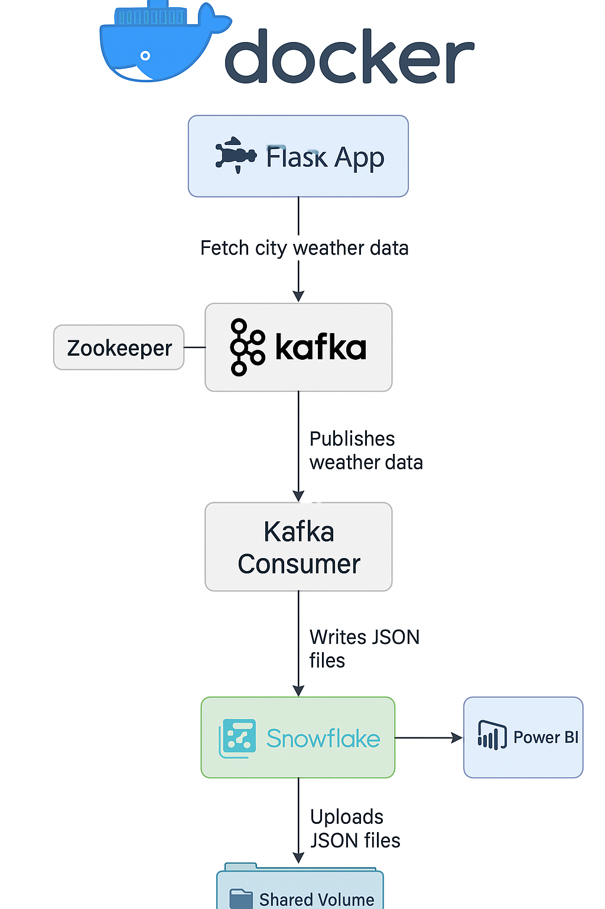
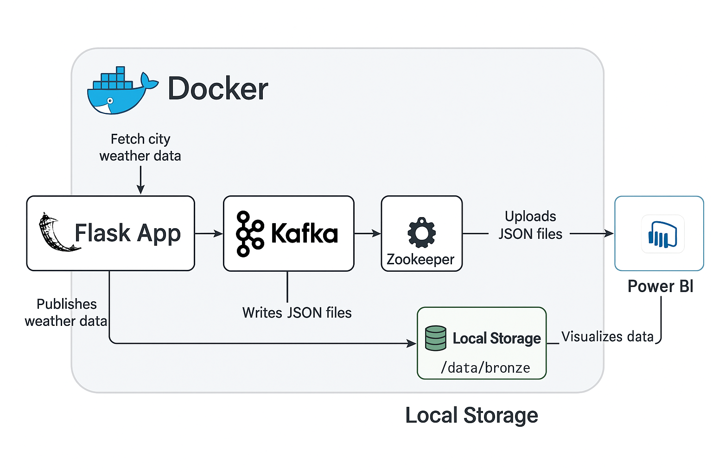

# weather_kafka_pipeline
# 🌦 End-to-End Weather Data Engineering Pipeline  
# Building a Modern Data Engineering Pipeline with Flask, Kafka, Snowflake, and Power BI

🔥 **Introduction**

This repository demonstrates how to design and deploy a **modern data engineering architecture** for real-time weather analytics.  
The pipeline integrates **Flask**, **Kafka**, **Snowflake**, and **Power BI** within a **Dockerized environment**, enabling a scalable, reliable, and production-grade data flow from raw API ingestion to actionable business intelligence.

With its modular design, this solution ensures:

- Efficient streaming of real-time data.
- Scalable ingestion and transformation pipelines.
- Business-ready analytics powered by Power BI dashboards.

Whether you are a data engineer, analyst, or cloud enthusiast, this project provides a complete blueprint to build, run, and visualize streaming data end-to-end.

---

## 💡 Why This Architecture Matters

Modern analytics workloads must handle high-velocity data coming from diverse sources — APIs, IoT devices, logs, and sensors.  
Traditional monolithic ETL processes are slow, unscalable, and hard to maintain.

This architecture solves these challenges by combining the strengths of **Kafka’s distributed streaming**, **Snowflake’s cloud data warehousing**, and **Power BI’s visualization** capabilities.

Key advantages include:

- 🚀 **Real-Time Ingestion:** Collects live weather data directly from OpenWeather API.
- ⚙️ **Stream-Based Design:** Decouples producers and consumers for scalability.
- ❄️ **Cloud-Native Storage:** Uses Snowflake for structured and reliable data persistence.
- 📊 **Actionable Insights:** Delivers dynamic Power BI dashboards with interactive analysis.
- 🐳 **Containerized Simplicity:** Entire stack orchestrated using Docker Compose.

---

## 🧩 System Overview

The architecture is divided into several key layers:

1. **Ingestion (Flask App)** – Fetches data from OpenWeather API.
2. **Streaming (Kafka)** – Publishes city weather metrics in real-time.
3. **Storage (JSON Bronze Layer)** – Writes batched data to local storage.
4. **Warehouse (Snowflake)** – Uploads structured JSON data for analytics.
5. **Visualization (Power BI)** – Connects directly to Snowflake for dashboarding.

---

## 📊 High-Level Architecture



This diagram shows the end-to-end flow of data from the weather API through Kafka into Snowflake and finally to Power BI.

---

## 🐳 Dockerized System Architecture



The Dockerized environment encapsulates all services — Flask app, Kafka broker, Zookeeper, and Consumer — ensuring easy setup and consistent behavior across machines.

---

## ⚙️ Pipeline Components

### **Flask App (Data Producer)**
- Requests real-time weather data via the OpenWeather API.
- Pushes responses as JSON payloads to a Kafka topic (`weather_topic`).

### **Kafka Broker & Zookeeper**
- Kafka manages message queues for asynchronous communication.
- Zookeeper handles broker coordination.

### **Kafka Consumer**
- Reads messages from `weather_topic`.
- Writes data into `/data/bronze/` as minute-wise JSON batches.

### **Uploader (Snowflake Loader)**
- Detects new JSON files in the bronze folder.
- Executes `PUT` and `COPY INTO` commands to insert data into Snowflake.

### **Snowflake**
- Stores structured weather data in `WEATHER_DATA_JSON` table.
- Enables querying, aggregation, and analysis.

### **Power BI**
- Connects to Snowflake to visualize temperature, humidity, and wind trends.
- Allows drill-down and trend analysis across time and cities.

---

## 🔧 High-Performance Processing

- **Kafka** enables horizontal scalability and near real-time throughput.
- **Snowflake** optimizes compute/storage with automatic scaling.
- **Docker Compose** simplifies multi-service orchestration and isolation.

---

## 🧱 Bronze–Silver–Gold Analogy (Data Layers)

- **Bronze Layer:** Raw JSON files from Kafka consumers.
- **Silver Layer:** Structured Snowflake data after schema enforcement.
- **Gold Layer:** Power BI analytics-ready datasets.

This separation ensures traceability, quality control, and easy reprocessing.

---

## 📈 Business Intelligence & Insights

Once data reaches Snowflake, Power BI connects directly to create visual dashboards such as:

- **City-wise Temperature Heatmap**
- **Humidity vs. Wind Speed Trends**
- **Daily Weather Summary**
- **Real-Time Weather Feed**

This provides both operational monitoring and strategic analysis capabilities.

---

## 💪 Real-World Use Cases

- **IoT Monitoring:** Collect weather data from distributed sensors.
- **Smart Agriculture:** Track climate variables for predictive farming.
- **Energy Demand Forecasting:** Combine temperature trends with power usage.
- **Environmental Analysis:** Monitor real-time pollution and weather correlation.

---

## 🧰 Key Technologies

| Layer | Technology | Role |
|-------|-------------|------|
| API Ingestion | Flask | Fetches real-time weather data |
| Streaming | Apache Kafka | Manages message queues |
| Storage | JSON (Bronze Layer) | Persists batched records |
| Data Warehouse | Snowflake | Cloud-based structured storage |
| Visualization | Power BI | Business intelligence dashboards |
| Orchestration | Docker Compose | Containerized service management |

---

## 🚀 How to Get Started

### **Prerequisites**
- Docker & Docker Compose installed
- Python 3.8+ (for local testing)
- Snowflake account with database and stage setup
- Power BI Desktop for visualization

### **Setup Steps**
1. Clone the repository:
   ```bash
   git clone https://github.com/<your-username>/weather-data-pipeline.git
   cd weather-data-pipeline


